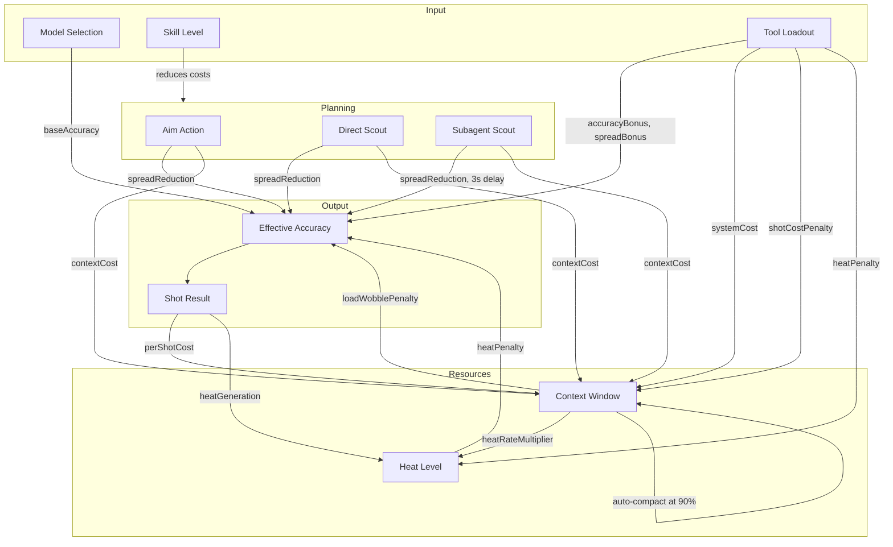

# Vibeslinger Game Mechanics

## Overview

Vibeslinger is a firing-range game that teaches AI inference concepts through a gunslinger metaphor. The player selects an AI model (gun), manages a context window (ammo/resource), uses planning actions (aim/scout) to improve accuracy, and fires shots at a target. The core tension: better accuracy requires spending limited context, and overloading the context degrades performance.

---

## Core Systems

### 1. Model Selection (Guns)

Each gun represents an AI model with distinct characteristics:

| Model | Base Accuracy | Heat Rate | Beam Width |
|-------|:---:|:---:|:---:|
| Claude Opus 4.6 | 55% | 1.3x | 1.5 |
| GPT-5.4 | 52% | 1.2x | 1.8 |
| Claude Sonnet 4.6 | 48% | 1.0x | 2.0 |
| Gemini 2.5 Pro | 45% | 1.0x | 2.2 |
| GPT-4.1 | 42% | 0.8x | 2.5 |
| Claude Haiku 4.5 | 35% | 0.6x | 3.5 |

**Trade-off:** Higher accuracy models generate heat faster and have narrower beams (less forgiving).

### 2. Firing Mechanics

**Effective accuracy** combines multiple factors:

```
effectiveAccuracy = (baseAccuracy + toolAccuracyBonus + aimBonus) × heatPenalty × loadPenalty
```

Where:
- `aimBonus` = planning bonus spreadReduction × 0.3
- `heatPenalty` = 1.0 - (heatLevel × 0.35)
- `loadPenalty` = 1.0 - (loadWobblePenalty × 0.4)
- Clamped to [0.05, 0.99]

**Shot distribution** uses Box-Muller transform for Gaussian spread:
- `spread = (1.0 - accuracy) × 2.0 × spreadMultiplier`
- `spreadMultiplier = 1.0 - planningSpreadReduction - toolSpreadBonus`

**Bullseye system:**
- Only possible above 80% accuracy
- Chance scales linearly: 0% at 80% accuracy → 15% at 99% accuracy
- Bullseye shots land at exact center (Offset.zero)

### 3. Planning System

Planning actions trade context window capacity for accuracy bonuses.

**Actions:**

| Action | Context Cost | Bonus | Notes |
|--------|:---:|:---:|-------|
| Aim | 0.05 × skillScale | +0.30 × skillScale (diminishing) | Each use halves the bonus |
| Direct Scout | 0.08 × skillScale | +0.20 spread reduction | Instant |
| Subagent Scout | 0.03 × skillScale | +0.15 spread reduction | 3-second async delay, blocks firing |

- `skillScale` = 1.5 - (skillLevel × 0.5), so higher skill = lower cost
- Aim bonus uses diminishing returns: `base / (2^uses)`, so first aim gives 0.30, second gives 0.15, third gives 0.075...
- All bonuses capped at 0.90 spread reduction
- **All bonuses consumed on fire** — one shot per planning session

### 4. Context Window

Represents the model's limited context capacity. Three segment types occupy it:

**System segments** (persistent):
- Harness: 0.15 (always present)
- Tools: variable cost per loaded tool

**Buffer**: 0.15 (reserved, non-removable)

**User segments** (accumulated through actions):
- Aims, Scouts, Shots — each action adds to the corresponding segment

**Load thresholds:**

| Zone | Threshold | Effect |
|------|:---:|-------|
| Comfortable | ≤ 70% | No penalties |
| Overloaded | > 70% | Wobble penalty scales 0→1, heat rate scales 1→2 |
| Compaction Zone | > 81.64% | Visual warning |
| Near Full | > 89.99% | Auto-compact triggered, new context blocked |

**Compaction** scales all user segments to 40% and removes tiny segments (< 0.001). Planning bonuses also scale to 40%. Can be triggered manually (X key) or automatically at near-full.

### 5. Heat System

Heat represents inference compute cost / rate limiting.

- **Generation:** `0.09 × gun.heatRate × contextWindow.heatRateMultiplier × (1.0 + toolHeatPenalty)` per shot
- **Passive cooldown:** 0.02 every 200ms (disabled during rapid fire)
- **Warning:** Audio plays at > 0.8 heat, clears at < 0.6 (hysteresis)
- Heat reduces effective accuracy by up to 35%

### 6. Tool System

Tools occupy system context permanently but provide passive bonuses:

| Tool | System Cost | Benefit | Shot Cost Penalty | Heat Penalty |
|------|:---:|-------|:---:|:---:|
| Web Search | 0.08 | +10% scout effectiveness | +0.005 | — |
| Code Analysis | 0.10 | +10% base accuracy | +0.01 | — |
| File Reader | 0.06 | -5% spread | +0.005 | — |
| Code Review | 0.12 | +5% accuracy, -8% spread | +0.015 | +0.5 |
| Skill Creator | 0.15 | +25% accuracy | +0.02 | — |

**Trade-off:** Tools improve accuracy/spread but permanently consume system context and increase per-shot context cost. Code Review additionally increases heat generation.

---

## System Interactions



---

## Keyboard Controls

| Key | Action |
|-----|--------|
| Space | Fire (hold for rapid fire) |
| P | Toggle planning mode |
| A | Aim (planning action) |
| S | Direct scout (planning action) |
| D | Subagent scout (planning action, 3s async) |
| X | Manual compaction |
| C | Clear all shots and reset |

---

## Workspace

The workspace provides persistent file storage that survives across sessions, letting players carry forward plans and research.

### Save Actions

| Action | Context Cost | Produces |
|--------|:---:|-------|
| Save Plan | 4% | Plan file — captures current planning state |
| Save Research | 3% | Research file — captures scouting intel |

### Load Costs

Loading a saved file back into the context window costs context capacity:

| File Type | Base Load Cost | With File Reader Tool |
|-----------|:---:|:---:|
| Plan | 6% | 3% |
| Research | 4% | 2% |

The **File Reader** tool provides a 50% discount on all load costs.

### Passive Bonuses (When Loaded)

Loaded files provide passive bonuses as long as they remain in the context:

| File Type | Bonus |
|-----------|-------|
| Plan | -10% spread reduction |
| Research | +5% scout effectiveness, -5% aim cost |

### New Session (N Key)

Starting a new session:
- Clears all context (user segments reset)
- Resets all planning bonuses
- **Unloads** all workspace files (removes from context)
- **Keeps** all saved files in the workspace (available to reload)
- Tools persist across sessions

This lets players start fresh while retaining previously saved work for future loading.

---

## Key Formulas Reference

```
perShotCost = 0.02 × (1.5 - skillLevel × 0.75) + Σ(tool.shotCostPenalty)
heatPerShot = 0.09 × gun.heatRate × contextWindow.heatRateMultiplier × (1.0 + Σ(tool.heatPenalty))
cooldownRate = 0.02 / 200ms (disabled during rapid fire)
wobblePenalty = ((totalLoad - 0.70) / 0.30).clamp(0, 1) when totalLoad > 0.70
heatRateMultiplier = 1.0 + wobblePenalty when totalLoad > 0.70
aimBonus(n) = 0.30 × (0.5 + skillLevel × 0.5) / 2^n  [nth use]
planningCost(action) = baseCost × (1.5 - skillLevel × 0.5)
```
