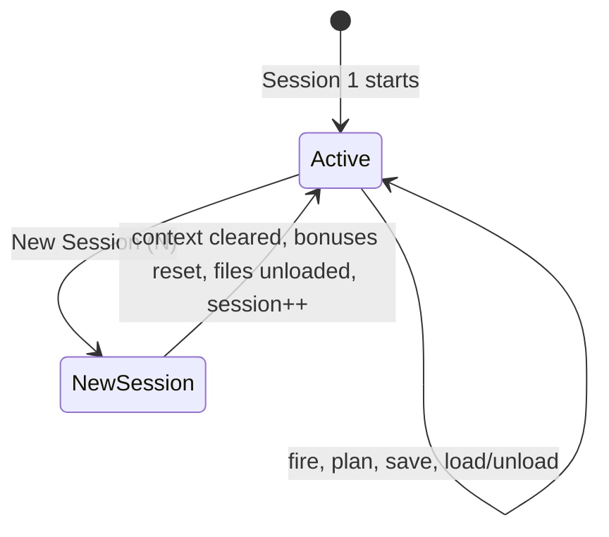
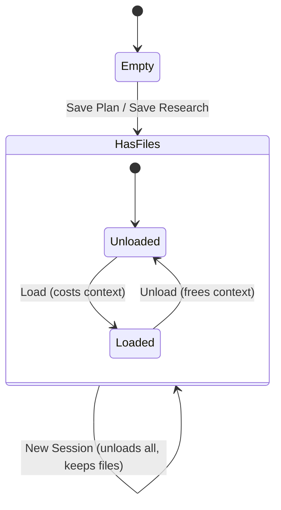

# Session & Workspace Implementation Plan

> **For Claude:** REQUIRED SUB-SKILL: Use superpowers:executing-plans to implement this plan task-by-task.

**Goal:** Replace the "Planning" sidebar section with "Session" and "Workspace" sections, adding save/load file mechanics and a "New Session" action.

**Architecture:** New `WorkspaceState` model manages saved files and load status. `GameState` gains workspace integration — save actions cost context, loaded files provide passive bonuses. Sidebar restructured into Session/Workspace/Fire sections. Keyboard shortcut C remapped from Reset to New Session, save actions get new shortcuts.

**Tech Stack:** Flutter/Dart, existing model+widget patterns

---

### Task 1: WorkspaceFile and WorkspaceState Model

**Files:**
- Create: `lib/models/workspace.dart`
- Test: `test/models/workspace_test.dart`

**Step 1: Write the failing tests**

```dart
// test/models/workspace_test.dart
import 'package:flutter_test/flutter_test.dart';
import 'package:inference_gunslinger/models/workspace.dart';

void main() {
  group('WorkspaceFile', () {
    test('has correct properties', () {
      final file = WorkspaceFile(
        type: WorkspaceFileType.plan,
        sessionNumber: 1,
      );
      expect(file.type, WorkspaceFileType.plan);
      expect(file.sessionNumber, 1);
      expect(file.name, 'plan_s1.md');
      expect(file.isLoaded, false);
    });

    test('plan has correct costs', () {
      final file = WorkspaceFile(type: WorkspaceFileType.plan, sessionNumber: 1);
      expect(file.saveCost, 0.04);
      expect(file.loadCost, 0.06);
    });

    test('research has correct costs', () {
      final file = WorkspaceFile(type: WorkspaceFileType.research, sessionNumber: 2);
      expect(file.saveCost, 0.03);
      expect(file.loadCost, 0.04);
      expect(file.name, 'research_s2.md');
    });
  });

  group('WorkspaceState', () {
    late WorkspaceState workspace;

    setUp(() {
      workspace = WorkspaceState();
    });

    test('starts empty at session 1', () {
      expect(workspace.files, isEmpty);
      expect(workspace.sessionNumber, 1);
    });

    test('saveFile adds a file', () {
      workspace.saveFile(WorkspaceFileType.plan);
      expect(workspace.files.length, 1);
      expect(workspace.files[0].name, 'plan_s1.md');
    });

    test('saveFile increments file count per type per session', () {
      workspace.saveFile(WorkspaceFileType.plan);
      workspace.saveFile(WorkspaceFileType.plan);
      expect(workspace.files.length, 2);
      expect(workspace.files[1].name, 'plan_s1_2.md');
    });

    test('loadFile sets isLoaded true', () {
      workspace.saveFile(WorkspaceFileType.plan);
      workspace.loadFile(0);
      expect(workspace.files[0].isLoaded, true);
    });

    test('unloadFile sets isLoaded false', () {
      workspace.saveFile(WorkspaceFileType.plan);
      workspace.loadFile(0);
      workspace.unloadFile(0);
      expect(workspace.files[0].isLoaded, false);
    });

    test('newSession increments session number and unloads all', () {
      workspace.saveFile(WorkspaceFileType.plan);
      workspace.loadFile(0);
      workspace.newSession();
      expect(workspace.sessionNumber, 2);
      expect(workspace.files[0].isLoaded, false);
      expect(workspace.files.length, 1); // file persists
    });

    test('loadedFiles returns only loaded files', () {
      workspace.saveFile(WorkspaceFileType.plan);
      workspace.saveFile(WorkspaceFileType.research);
      workspace.loadFile(0);
      expect(workspace.loadedFiles.length, 1);
      expect(workspace.loadedFiles[0].type, WorkspaceFileType.plan);
    });

    test('passive spread reduction from loaded plan', () {
      workspace.saveFile(WorkspaceFileType.plan);
      workspace.loadFile(0);
      expect(workspace.passiveSpreadReduction, 0.10);
    });

    test('passive scout bonus from loaded research', () {
      workspace.saveFile(WorkspaceFileType.research);
      workspace.loadFile(0);
      expect(workspace.passiveScoutBonus, 0.05);
    });

    test('passive aim cost reduction from loaded research', () {
      workspace.saveFile(WorkspaceFileType.research);
      workspace.loadFile(0);
      expect(workspace.passiveAimCostReduction, 0.05);
    });

    test('no passive bonuses when nothing loaded', () {
      workspace.saveFile(WorkspaceFileType.plan);
      // not loaded
      expect(workspace.passiveSpreadReduction, 0.0);
      expect(workspace.passiveScoutBonus, 0.0);
      expect(workspace.passiveAimCostReduction, 0.0);
    });

    test('file reader discount halves load cost', () {
      workspace.saveFile(WorkspaceFileType.plan);
      expect(workspace.files[0].loadCost, 0.06);
      expect(workspace.files[0].discountedLoadCost(hasFileReader: true), 0.03);
    });

    test('no discount without file reader', () {
      workspace.saveFile(WorkspaceFileType.plan);
      expect(workspace.files[0].discountedLoadCost(hasFileReader: false), 0.06);
    });
  });
}
```

**Step 2: Run tests to verify they fail**

Run: `flutter test test/models/workspace_test.dart`
Expected: FAIL — cannot find `package:inference_gunslinger/models/workspace.dart`

**Step 3: Write minimal implementation**

```dart
// lib/models/workspace.dart
enum WorkspaceFileType { plan, research }

class WorkspaceFile {
  final WorkspaceFileType type;
  final int sessionNumber;
  final int duplicateIndex;
  bool isLoaded;

  WorkspaceFile({
    required this.type,
    required this.sessionNumber,
    this.duplicateIndex = 0,
    this.isLoaded = false,
  });

  String get name {
    final prefix = type == WorkspaceFileType.plan ? 'plan' : 'research';
    final suffix = duplicateIndex > 0 ? '_${duplicateIndex + 1}' : '';
    return '${prefix}_s$sessionNumber$suffix.md';
  }

  double get saveCost => type == WorkspaceFileType.plan ? 0.04 : 0.03;
  double get loadCost => type == WorkspaceFileType.plan ? 0.06 : 0.04;

  double discountedLoadCost({required bool hasFileReader}) {
    return hasFileReader ? loadCost * 0.5 : loadCost;
  }

  // Passive bonuses when loaded
  double get spreadReduction => type == WorkspaceFileType.plan ? 0.10 : 0.0;
  double get scoutBonus => type == WorkspaceFileType.research ? 0.05 : 0.0;
  double get aimCostReduction => type == WorkspaceFileType.research ? 0.05 : 0.0;
}

class WorkspaceState {
  final List<WorkspaceFile> _files = [];
  int _sessionNumber = 1;

  List<WorkspaceFile> get files => List.unmodifiable(_files);
  int get sessionNumber => _sessionNumber;

  List<WorkspaceFile> get loadedFiles =>
      _files.where((f) => f.isLoaded).toList();

  void saveFile(WorkspaceFileType type) {
    final existing = _files
        .where((f) => f.type == type && f.sessionNumber == _sessionNumber)
        .length;
    _files.add(WorkspaceFile(
      type: type,
      sessionNumber: _sessionNumber,
      duplicateIndex: existing,
    ));
  }

  void loadFile(int index) {
    if (index >= 0 && index < _files.length) {
      _files[index].isLoaded = true;
    }
  }

  void unloadFile(int index) {
    if (index >= 0 && index < _files.length) {
      _files[index].isLoaded = false;
    }
  }

  void newSession() {
    _sessionNumber++;
    for (final file in _files) {
      file.isLoaded = false;
    }
  }

  double get passiveSpreadReduction =>
      loadedFiles.fold(0.0, (sum, f) => sum + f.spreadReduction);

  double get passiveScoutBonus =>
      loadedFiles.fold(0.0, (sum, f) => sum + f.scoutBonus);

  double get passiveAimCostReduction =>
      loadedFiles.fold(0.0, (sum, f) => sum + f.aimCostReduction);
}
```

**Step 4: Run tests to verify they pass**

Run: `flutter test test/models/workspace_test.dart`
Expected: ALL PASS

**Step 5: Commit**

```bash
git add lib/models/workspace.dart test/models/workspace_test.dart
git commit -m "feat: add WorkspaceFile and WorkspaceState models"
```

---

### Task 2: Add ContextSegmentType for Workspace Files

**Files:**
- Modify: `lib/models/context_window.dart:3` (add `workspaceFile` to enum)
- Test: `test/models/context_window_test.dart` (verify segment type exists)

**Step 1: Write failing test**

Add to `test/models/context_window_test.dart`:
```dart
test('workspace file segment type exists', () {
  final cw = ContextWindow();
  cw.consumeUserContext(
    ContextSegmentType.workspaceFile, 'plan_s1.md', 0.06, const Color(0xFF8866CC),
  );
  final seg = cw.userSegments.where((s) => s.type == ContextSegmentType.workspaceFile).firstOrNull;
  expect(seg, isNotNull);
  expect(seg!.label, 'plan_s1.md');
});
```

**Step 2: Run test to verify it fails**

Run: `flutter test test/models/context_window_test.dart`
Expected: FAIL — `ContextSegmentType.workspaceFile` doesn't exist

**Step 3: Add workspaceFile to enum**

In `lib/models/context_window.dart:3`, change:
```dart
enum ContextSegmentType { harness, tool, aim, scout, shot }
```
to:
```dart
enum ContextSegmentType { harness, tool, aim, scout, shot, workspaceFile }
```

**Step 4: Run tests to verify they pass**

Run: `flutter test test/models/context_window_test.dart`
Expected: ALL PASS

**Step 5: Commit**

```bash
git add lib/models/context_window.dart test/models/context_window_test.dart
git commit -m "feat: add workspaceFile context segment type"
```

---

### Task 3: Integrate WorkspaceState into GameState

**Files:**
- Modify: `lib/models/game_state.dart`
- Test: `test/models/game_state_test.dart`

**Step 1: Write failing tests**

Add to `test/models/game_state_test.dart`:
```dart
test('saveToWorkspace creates file and costs context', () {
  state.togglePlanning();
  final result = state.saveToWorkspace(WorkspaceFileType.plan);
  expect(result, true);
  expect(state.workspace.files.length, 1);
  final seg = state.contextWindow.userSegments
      .where((s) => s.type == ContextSegmentType.workspaceFile)
      .firstOrNull;
  expect(seg, isNotNull);
});

test('loadWorkspaceFile costs context', () {
  state.togglePlanning();
  state.saveToWorkspace(WorkspaceFileType.plan);
  final loadBefore = state.contextWindow.userLoad;
  state.loadWorkspaceFile(0);
  expect(state.contextWindow.userLoad, greaterThan(loadBefore));
  expect(state.workspace.files[0].isLoaded, true);
});

test('unloadWorkspaceFile frees context', () {
  state.togglePlanning();
  state.saveToWorkspace(WorkspaceFileType.plan);
  state.loadWorkspaceFile(0);
  final loadBefore = state.contextWindow.userLoad;
  state.unloadWorkspaceFile(0);
  expect(state.contextWindow.userLoad, lessThan(loadBefore));
  expect(state.workspace.files[0].isLoaded, false);
});

test('loaded plan improves spread reduction in accuracy', () {
  state.togglePlanning();
  state.saveToWorkspace(WorkspaceFileType.plan);
  final beforeLoad = state.effectiveAccuracy;
  state.loadWorkspaceFile(0);
  // Plan gives +10% spread reduction which feeds into accuracy
  expect(state.effectiveAccuracy, greaterThan(beforeLoad));
});

test('loaded research reduces aim cost', () {
  state.togglePlanning();
  state.saveToWorkspace(WorkspaceFileType.research);
  state.loadWorkspaceFile(0);
  final costWithResearch = state.planning.contextCostFor(
    PlanningAction.aim, skillLevel: state.skillLevel,
  );
  // Research gives -5% aim cost reduction
  // Base expert aim cost is 0.05, with 5% reduction = 0.0475
  expect(costWithResearch, lessThan(0.05));
});

test('newSession clears context and unloads files but keeps them', () {
  state.togglePlanning();
  state.saveToWorkspace(WorkspaceFileType.plan);
  state.loadWorkspaceFile(0);
  state.fire();
  state.newSession();
  expect(state.workspace.files.length, 1);
  expect(state.workspace.files[0].isLoaded, false);
  expect(state.contextWindow.userLoad, 0.0);
  expect(state.shots, isEmpty);
  expect(state.heatLevel, 0.0);
  expect(state.workspace.sessionNumber, 2);
});

test('newSession keeps tools loaded', () {
  state.loadTool(ToolType.webSearch);
  state.newSession();
  expect(state.loadedTools.contains(ToolType.webSearch), true);
});

test('file reader tool halves workspace load cost', () {
  state.togglePlanning();
  state.saveToWorkspace(WorkspaceFileType.plan);
  state.loadTool(ToolType.fileReader);
  final loadBefore = state.contextWindow.userLoad;
  state.loadWorkspaceFile(0);
  final loadAfter = state.contextWindow.userLoad;
  // File reader discount: 0.06 * 0.5 = 0.03
  expect(loadAfter - loadBefore, closeTo(0.03, 0.005));
});

test('firing does NOT consume workspace file bonuses', () {
  state.togglePlanning();
  state.saveToWorkspace(WorkspaceFileType.plan);
  state.loadWorkspaceFile(0);
  state.fire();
  // File is still loaded, bonus persists
  expect(state.workspace.files[0].isLoaded, true);
  expect(state.workspace.passiveSpreadReduction, 0.10);
});
```

Add import at top of test file:
```dart
import 'package:inference_gunslinger/models/workspace.dart';
```

**Step 2: Run tests to verify they fail**

Run: `flutter test test/models/game_state_test.dart`
Expected: FAIL — methods don't exist

**Step 3: Implement GameState integration**

In `lib/models/game_state.dart`, add import:
```dart
import 'workspace.dart';
```

Add to `GameState` class fields (after `_loadedTools`):
```dart
final WorkspaceState _workspace = WorkspaceState();
```

Add getter (after `loadedTools` getter):
```dart
WorkspaceState get workspace => _workspace;
```

Update `effectiveAccuracy` getter to include workspace bonuses:
```dart
double get effectiveAccuracy {
  final base = _selectedGun.baseAccuracy + _toolAccuracyBonus;
  final aimBonus = _planning.bonus.spreadReduction * 0.3;
  final workspaceSpreadBonus = _workspace.passiveSpreadReduction * 0.3;
  final heat = 1.0 - (_heatLevel * 0.35);
  final loadPenalty = 1.0 - (_contextWindow.loadWobblePenalty * 0.4);
  return ((base + aimBonus + workspaceSpreadBonus) * heat * loadPenalty).clamp(0.05, 0.99);
}
```

Update `fire()` spread calculation to include workspace:
```dart
final spreadMultiplier = 1.0 - _planning.bonus.spreadReduction - _toolSpreadBonus - _workspace.passiveSpreadReduction;
```

Add workspace methods:
```dart
bool saveToWorkspace(WorkspaceFileType type) {
  _autoCompactIfNeeded();
  if (_contextWindow.isNearFull) return false;
  final file = WorkspaceFile(type: type, sessionNumber: _workspace.sessionNumber);
  if (!_contextWindow.consumeUserContext(
    ContextSegmentType.workspaceFile, 'Save ${type.name}', file.saveCost, const Color(0xFF8866CC),
  )) return false;
  _workspace.saveFile(type);
  notifyListeners();
  return true;
}

bool loadWorkspaceFile(int index) {
  if (index < 0 || index >= _workspace.files.length) return false;
  final file = _workspace.files[index];
  if (file.isLoaded) return false;
  _autoCompactIfNeeded();
  if (_contextWindow.isNearFull) return false;
  final cost = file.discountedLoadCost(hasFileReader: _loadedTools.contains(ToolType.fileReader));
  if (!_contextWindow.consumeUserContext(
    ContextSegmentType.workspaceFile, file.name, cost, const Color(0xFF8866CC),
  )) return false;
  _workspace.loadFile(index);
  notifyListeners();
  return true;
}

bool unloadWorkspaceFile(int index) {
  if (index < 0 || index >= _workspace.files.length) return false;
  final file = _workspace.files[index];
  if (!file.isLoaded) return false;
  // Remove context cost — find matching segment and reduce
  final cost = file.discountedLoadCost(hasFileReader: _loadedTools.contains(ToolType.fileReader));
  final seg = _contextWindow.userSegments
      .where((s) => s.type == ContextSegmentType.workspaceFile)
      .firstOrNull;
  if (seg != null) {
    seg.amount = (seg.amount - cost).clamp(0.0, 1.0);
    if (seg.amount < 0.001) {
      _contextWindow.userSegments.removeWhere(
        (s) => s.type == ContextSegmentType.workspaceFile && s.amount < 0.001,
      );
    }
  }
  _workspace.unloadFile(index);
  notifyListeners();
  return true;
}

void newSession() {
  _shots.clear();
  _heatLevel = 0.0;
  _contextWindow.reset();
  // Re-add tool segments (tools persist across sessions)
  for (final type in _loadedTools) {
    final tool = Tool.all.firstWhere((t) => t.type == type);
    _contextWindow.addToolSegment(tool.name, tool.systemCost, const Color(0xFF5599DD));
  }
  _planning.reset();
  _workspace.newSession();
  notifyListeners();
}
```

Update `contextCostFor` in `PlanningState` to accept an aim cost reduction parameter. In `lib/models/planning.dart`, change `contextCostFor`:
```dart
double contextCostFor(PlanningAction action, {double skillLevel = 1.0, double aimCostReduction = 0.0}) {
  final skillScale = 1.5 - skillLevel * 0.5;
  switch (action) {
    case PlanningAction.aim:
      return 0.05 * skillScale * (1.0 - aimCostReduction);
    case PlanningAction.directScout:
      return 0.08 * skillScale;
    case PlanningAction.subagentScout:
      return 0.03 * skillScale;
  }
}
```

Update `executePlanningAction` in `GameState` to pass aim cost reduction:
```dart
bool executePlanningAction(PlanningAction action) {
  _autoCompactIfNeeded();
  if (_contextWindow.isNearFull) return false;
  final aimReduction = action == PlanningAction.aim ? _workspace.passiveAimCostReduction : 0.0;
  final cost = _planning.contextCostFor(action, skillLevel: _skillLevel, aimCostReduction: aimReduction);
  final segType = action == PlanningAction.aim
      ? ContextSegmentType.aim
      : ContextSegmentType.scout;
  final segLabel = action == PlanningAction.aim ? 'Aims' : 'Scouts';
  final segColor = action == PlanningAction.aim ? _aimColor : _scoutColor;
  if (!_contextWindow.consumeUserContext(segType, segLabel, cost, segColor)) return false;
  final result = _planning.applyAction(action, skillLevel: _skillLevel);
  if (result) notifyListeners();
  return result;
}
```

**Step 4: Run all tests**

Run: `flutter test`
Expected: ALL PASS

**Step 5: Commit**

```bash
git add lib/models/game_state.dart lib/models/planning.dart test/models/game_state_test.dart
git commit -m "feat: integrate workspace into game state with save/load/newSession"
```

---

### Task 4: Update Sidebar — Rename Planning to Session, Add New Session

**Files:**
- Modify: `lib/widgets/sidebar_panel.dart:110` (rename section label)
- Modify: `lib/widgets/sidebar_panel.dart:250-266` (replace Reset with New Session, move into Session section)

**Step 1: In `sidebar_panel.dart`, change line 110**

```dart
// Change:
_sectionLabel('PLANNING'),
// To:
_sectionLabel('SESSION'),
```

**Step 2: Remove the standalone Reset button (lines 250-266) and add New Session at top of Session section**

Replace the Reset `OutlinedButton` block (lines 250-266) with nothing (delete it).

After the Session section label and before the plan toggle, add:
```dart
_infoRow(
  child: SizedBox(
    width: double.infinity,
    child: OutlinedButton.icon(
      onPressed: () {
        _audio.playClear();
        widget.state.newSession();
        widget.onFocusFiringRange?.call();
      },
      icon: const Icon(Icons.refresh, size: 16),
      label: Text(
        'New Session (N) — S${widget.state.workspace.sessionNumber}',
        style: const TextStyle(fontSize: 12),
      ),
      style: OutlinedButton.styleFrom(
        foregroundColor: Colors.white54,
        side: const BorderSide(color: Colors.white24),
      ),
    ),
  ),
  onInfo: () => _showInfo(
    'New Session',
    'Clears the context window and starts a new session. All planning bonuses reset. '
    'Workspace files remain saved but are unloaded — you choose what to bring back.\n\n'
    'Tools stay loaded (they are system-level). Session number increments.\n\n'
    'Maps to starting a new AI conversation — your saved artifacts persist on disk, '
    'but the conversation context is fresh.',
    accuracyImpact: 'Resets all session-level bonuses, unloads workspace files',
  ),
),
const SizedBox(height: 6),
```

**Step 3: Update keyboard hints (line 270-276)**

Change:
```dart
'Space: Fire\n'
'P: Plan mode\n'
'A: Focus  S: Scout  D: Subagent\n'
'X: Compact  C: Clear',
```
To:
```dart
'Space: Fire\n'
'P: Plan mode  N: New Session\n'
'A: Focus  S: Scout  D: Subagent\n'
'X: Compact  W: Save Plan  E: Save Research',
```

**Step 4: Run the app and verify visually**

Run: `flutter run -d chrome`
Expected: Session section shows with New Session button at top, no more standalone Reset button

**Step 5: Commit**

```bash
git add lib/widgets/sidebar_panel.dart
git commit -m "feat: rename Planning to Session, replace Reset with New Session"
```

---

### Task 5: Add Workspace Section to Sidebar

**Files:**
- Modify: `lib/widgets/sidebar_panel.dart` (add Workspace section between Session and Fire)

**Step 1: Add Workspace section**

After the Compact button's `_infoRow` and `SizedBox(height: 8)`, before the Fire divider, insert:

```dart
const Divider(color: Colors.white24),
const SizedBox(height: 8),

// Workspace section
_sectionLabel('WORKSPACE'),
Row(
  children: [
    Expanded(
      child: _buildPlanAction(
        icon: Icons.map,
        label: 'Save Plan (W)',
        enabled: !isExecuting && !widget.state.contextWindow.isNearFull,
        color: const Color(0xFF8866CC),
        onPressed: () {
          if (widget.state.saveToWorkspace(WorkspaceFileType.plan)) {
            _audio.playAim(); // reuse aim sound for save
          }
          widget.onFocusFiringRange?.call();
        },
      ),
    ),
    const SizedBox(width: 6),
    Expanded(
      child: _buildPlanAction(
        icon: Icons.science,
        label: 'Save Research (E)',
        enabled: !isExecuting && !widget.state.contextWindow.isNearFull,
        color: const Color(0xFF6688BB),
        onPressed: () {
          if (widget.state.saveToWorkspace(WorkspaceFileType.research)) {
            _audio.playScout(); // reuse scout sound for research save
          }
          widget.onFocusFiringRange?.call();
        },
      ),
    ),
  ],
),
const SizedBox(height: 6),
_buildWorkspaceFileList(),
const SizedBox(height: 8),
```

**Step 2: Add `_buildWorkspaceFileList` method**

Add to `_SidebarPanelState`:
```dart
Widget _buildWorkspaceFileList() {
  final files = widget.state.workspace.files;
  final hasFileReader = widget.state.loadedTools.contains(ToolType.fileReader);
  if (files.isEmpty) {
    return const Padding(
      padding: EdgeInsets.symmetric(vertical: 8),
      child: Text(
        'No saved files',
        style: TextStyle(color: Colors.white24, fontSize: 11, fontStyle: FontStyle.italic),
        textAlign: TextAlign.center,
      ),
    );
  }
  return Column(
    children: [
      for (int i = 0; i < files.length; i++)
        Padding(
          padding: const EdgeInsets.only(bottom: 4),
          child: _buildWorkspaceFileRow(files[i], i, hasFileReader),
        ),
    ],
  );
}

Widget _buildWorkspaceFileRow(WorkspaceFile file, int index, bool hasFileReader) {
  final icon = file.type == WorkspaceFileType.plan ? Icons.map : Icons.science;
  final color = file.type == WorkspaceFileType.plan
      ? const Color(0xFF8866CC)
      : const Color(0xFF6688BB);
  final cost = file.discountedLoadCost(hasFileReader: hasFileReader);
  final costPercent = (cost * 100).toStringAsFixed(0);
  final originalCost = (file.loadCost * 100).toStringAsFixed(0);
  final hasDiscount = hasFileReader && cost < file.loadCost;

  return Container(
    padding: const EdgeInsets.symmetric(horizontal: 8, vertical: 6),
    decoration: BoxDecoration(
      color: file.isLoaded ? color.withValues(alpha: 0.2) : Colors.white.withValues(alpha: 0.05),
      borderRadius: BorderRadius.circular(4),
    ),
    child: Row(
      children: [
        Icon(icon, size: 14, color: color),
        const SizedBox(width: 6),
        Expanded(
          child: Text(
            file.name,
            style: TextStyle(color: Colors.white70, fontSize: 11),
          ),
        ),
        if (hasDiscount)
          Text(
            '$originalCost%',
            style: const TextStyle(
              color: Colors.white30,
              fontSize: 10,
              decoration: TextDecoration.lineThrough,
            ),
          ),
        if (hasDiscount) const SizedBox(width: 4),
        Text(
          '$costPercent%',
          style: TextStyle(
            color: hasDiscount ? Colors.greenAccent.withValues(alpha: 0.7) : Colors.white38,
            fontSize: 10,
          ),
        ),
        const SizedBox(width: 6),
        GestureDetector(
          onTap: () {
            if (file.isLoaded) {
              widget.state.unloadWorkspaceFile(index);
              _audio.playToolUnload();
            } else {
              if (widget.state.loadWorkspaceFile(index)) {
                _audio.playToolLoad();
              }
            }
            widget.onFocusFiringRange?.call();
          },
          child: Container(
            padding: const EdgeInsets.symmetric(horizontal: 8, vertical: 2),
            decoration: BoxDecoration(
              color: file.isLoaded ? color.withValues(alpha: 0.4) : Colors.transparent,
              border: Border.all(color: file.isLoaded ? color : Colors.white24),
              borderRadius: BorderRadius.circular(3),
            ),
            child: Text(
              file.isLoaded ? 'Unload' : 'Load',
              style: TextStyle(
                color: file.isLoaded ? Colors.white : Colors.white54,
                fontSize: 10,
              ),
            ),
          ),
        ),
      ],
    ),
  );
}
```

**Step 3: Add workspace import to sidebar**

At top of `sidebar_panel.dart`, add:
```dart
import '../models/workspace.dart';
```

**Step 4: Run the app and verify visually**

Run: `flutter run -d chrome`
Expected: Workspace section visible with Save Plan / Save Research buttons, file list appears after saving

**Step 5: Commit**

```bash
git add lib/widgets/sidebar_panel.dart
git commit -m "feat: add Workspace section to sidebar with save/load UI"
```

---

### Task 6: Update Keyboard Shortcuts

**Files:**
- Modify: `lib/widgets/game_canvas.dart` (remap C→N for new session, add W and E for saves)

**Step 1: Update key handlers**

In `lib/widgets/game_canvas.dart`, find the `keyC` handler and change it:

```dart
// Change keyC from clearShots to newSession:
if (key == LogicalKeyboardKey.keyC) {
  _audio.playClear();
  widget.state.newSession();
}
```

Wait — actually per the design, C should become N (New Session). Change:
```dart
// Replace:
if (key == LogicalKeyboardKey.keyC) {
  _audio.playClear();
  widget.state.clearShots();
}
// With:
if (key == LogicalKeyboardKey.keyN) {
  _audio.playClear();
  widget.state.newSession();
}
```

Add after the keyX compact handler:
```dart
if (key == LogicalKeyboardKey.keyW) {
  widget.state.saveToWorkspace(WorkspaceFileType.plan);
}
if (key == LogicalKeyboardKey.keyE) {
  widget.state.saveToWorkspace(WorkspaceFileType.research);
}
```

Add import at top of `game_canvas.dart`:
```dart
import '../models/workspace.dart';
```

**Step 2: Run the app and test keyboard shortcuts**

Run: `flutter run -d chrome`
Expected: N = new session, W = save plan, E = save research, C no longer does anything

**Step 3: Commit**

```bash
git add lib/widgets/game_canvas.dart
git commit -m "feat: update keyboard shortcuts for session/workspace actions"
```

---

### Task 7: Update Existing Tests for Breaking Changes

**Files:**
- Modify: `test/models/planning_test.dart:12-15` (PlanningState now starts in planning mode)
- Modify: `test/models/game_state_test.dart` (clearShots → newSession where appropriate)

**Step 1: Fix planning_test.dart**

The `PlanningState` constructor sets `_isPlanning = true` (line 26 of planning.dart). But the test on line 12 expects `isPlanning` to be false. Check: `PlanningState.reset()` sets `_isPlanning = false`. The test creates a fresh `PlanningState()` which starts with `_isPlanning = true`.

Update test:
```dart
test('starts in planning mode', () {
  expect(planning.isPlanning, true);
  expect(planning.canFire, true); // canFire only checks isExecutingAction
});

test('toggle disables planning', () {
  planning.togglePlanning();
  expect(planning.isPlanning, false);
});
```

Wait — check the `canFire` getter: `bool get canFire => !_isExecutingAction;`. It does NOT check `_isPlanning`. So `canFire` is true even when planning. The existing test expects `canFire` to be `true` when not planning, which is also true when planning. So actually only the `isPlanning` assertion needs fixing.

**Step 2: In game_state_test.dart, update clearShots tests to reference newSession**

The existing `clearShots` method is being replaced by `newSession`. However, `clearShots` also clears tools — `newSession` does not. We need to keep `clearShots` for backward compatibility in tests that rely on full reset, OR update those tests.

Decision: Keep `clearShots` as-is (it's used internally for full game reset). `newSession` is the new user-facing action. The tests that call `clearShots()` as a helper to reset state between assertions can stay as-is.

**Step 3: Run all tests**

Run: `flutter test`
Expected: ALL PASS (fix any failures from the planning state default change)

**Step 4: Commit**

```bash
git add test/
git commit -m "test: update tests for planning-starts-active and workspace integration"
```

---

### Task 8: Add Info Button for Workspace Section

**Files:**
- Modify: `lib/widgets/sidebar_panel.dart` (add info buttons for save actions)

**Step 1: Wrap save buttons in info rows**

Replace the save buttons Row with info rows. The save buttons should each have their own info page explaining what they do.

Add info row for Save Plan:
```dart
_infoRow(
  child: Row(
    children: [
      Expanded(
        child: _buildPlanAction(
          icon: Icons.map,
          label: 'Save Plan (W)',
          enabled: !isExecuting && !widget.state.contextWindow.isNearFull,
          color: const Color(0xFF8866CC),
          onPressed: () {
            if (widget.state.saveToWorkspace(WorkspaceFileType.plan)) {
              _audio.playAim();
            }
            widget.onFocusFiringRange?.call();
          },
        ),
      ),
      const SizedBox(width: 6),
      Expanded(
        child: _buildPlanAction(
          icon: Icons.science,
          label: 'Research (E)',
          enabled: !isExecuting && !widget.state.contextWindow.isNearFull,
          color: const Color(0xFF6688BB),
          onPressed: () {
            if (widget.state.saveToWorkspace(WorkspaceFileType.research)) {
              _audio.playScout();
            }
            widget.onFocusFiringRange?.call();
          },
        ),
      ),
    ],
  ),
  onInfo: () => _showInfo(
    'Workspace Files',
    'Save insights from your session as persistent files.\n\n'
    '• Save Plan (4% context): Structured reasoning → -10% spread when loaded\n'
    '• Save Research (3% context): Raw findings → +5% scout effectiveness, -5% aim cost when loaded\n\n'
    'Files persist across sessions. Loading files costs context (reduced 50% by File Reader tool). '
    'Your workspace is unlimited, but loading too many files bloats context.\n\n'
    'Maps to saving conversation artifacts (plans, research notes) to the file system — '
    'cheap to store, but costs context to reference.',
    accuracyImpact: 'Save: 3-4% context cost. Load: 4-6% context (halved with File Reader)',
  ),
),
```

**Step 2: Run app to verify**

Run: `flutter run -d chrome`
Expected: Info button appears next to save buttons

**Step 3: Commit**

```bash
git add lib/widgets/sidebar_panel.dart
git commit -m "feat: add info button for workspace save actions"
```

---

### Task 9: Final Integration Test — Full Gameplay Loop

**Files:**
- Modify: `test/models/game_state_test.dart`

**Step 1: Write integration test**

Add to game_state_test.dart:
```dart
test('full session-workspace gameplay loop', () {
  // Session 1: plan, scout, save, fire
  state.togglePlanning();
  state.executePlanningAction(PlanningAction.aim);
  state.executePlanningAction(PlanningAction.directScout);
  state.saveToWorkspace(WorkspaceFileType.plan);
  state.saveToWorkspace(WorkspaceFileType.research);
  expect(state.workspace.files.length, 2);
  state.fire();

  // New session — files persist, context clears
  state.newSession();
  expect(state.workspace.files.length, 2);
  expect(state.workspace.files[0].isLoaded, false);
  expect(state.contextWindow.userLoad, 0.0);
  expect(state.shots, isEmpty);
  expect(state.workspace.sessionNumber, 2);

  // Session 2: load files back, verify bonuses
  state.loadWorkspaceFile(0); // plan
  state.loadWorkspaceFile(1); // research
  expect(state.workspace.loadedFiles.length, 2);

  // Loaded plan should improve accuracy
  final withFiles = state.effectiveAccuracy;
  state.unloadWorkspaceFile(0);
  state.unloadWorkspaceFile(1);
  final withoutFiles = state.effectiveAccuracy;
  expect(withFiles, greaterThan(withoutFiles));
});
```

**Step 2: Run all tests**

Run: `flutter test`
Expected: ALL PASS

**Step 3: Commit**

```bash
git add test/models/game_state_test.dart
git commit -m "test: add full session-workspace gameplay loop integration test"
```

---

### Task 10: Update Documentation

**Files:**
- Modify: `docs/state-machines.md` (add Session and Workspace state machines)
- Modify: `docs/game-mechanics.md` (add workspace mechanics)

**Step 1: Add Session state machine to state-machines.md**

Append:
```markdown
## Session State Machine



## Workspace State Machine


```

**Step 2: Update game-mechanics.md with workspace section**

Add a Workspace section describing save costs, load costs, passive bonuses, and File Reader interaction.

**Step 3: Commit**

```bash
git add docs/
git commit -m "docs: add session and workspace state machines and mechanics"
```
