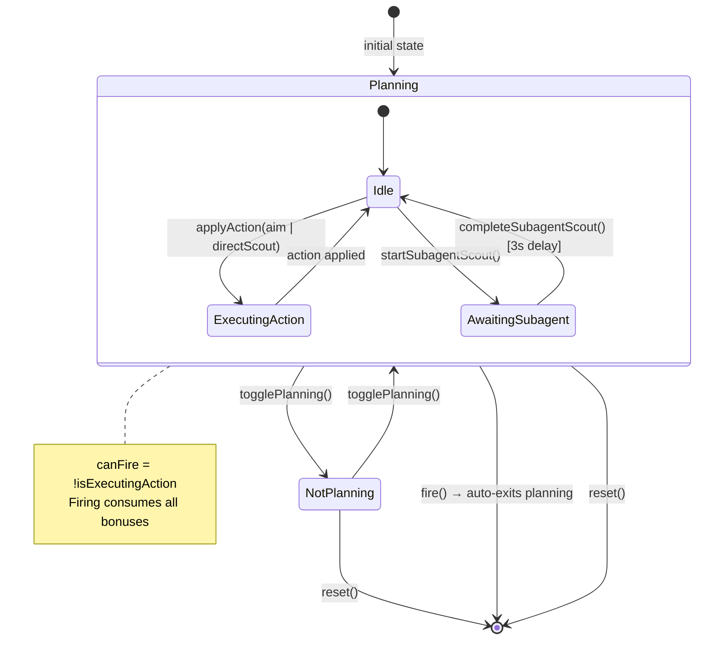
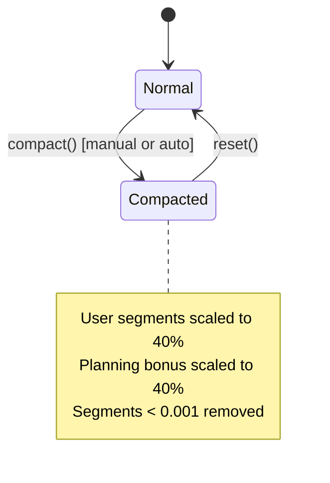
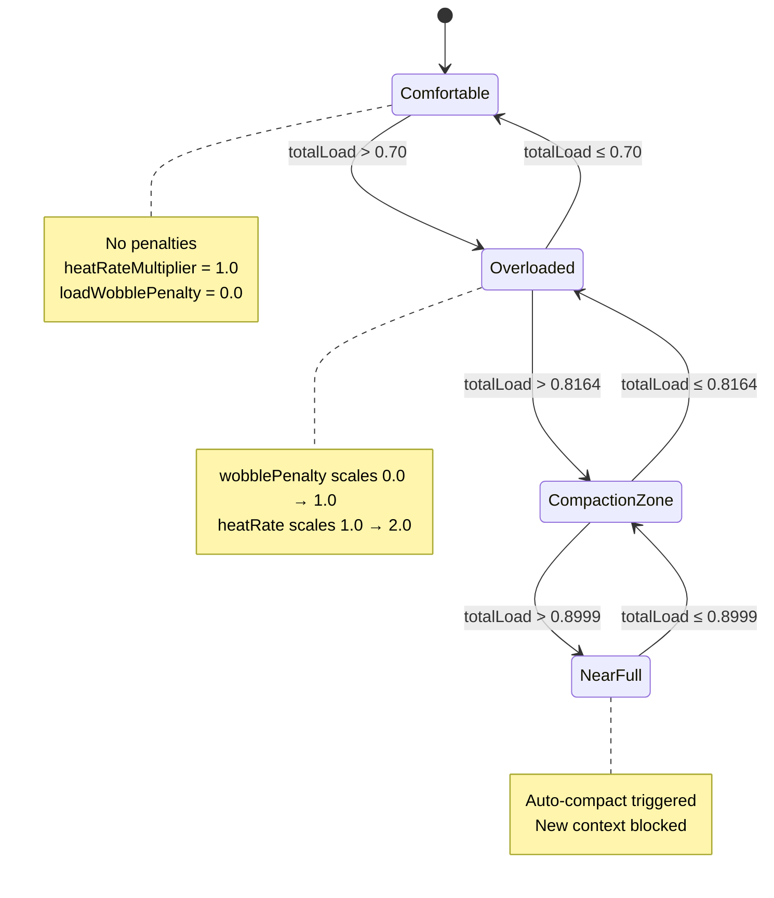
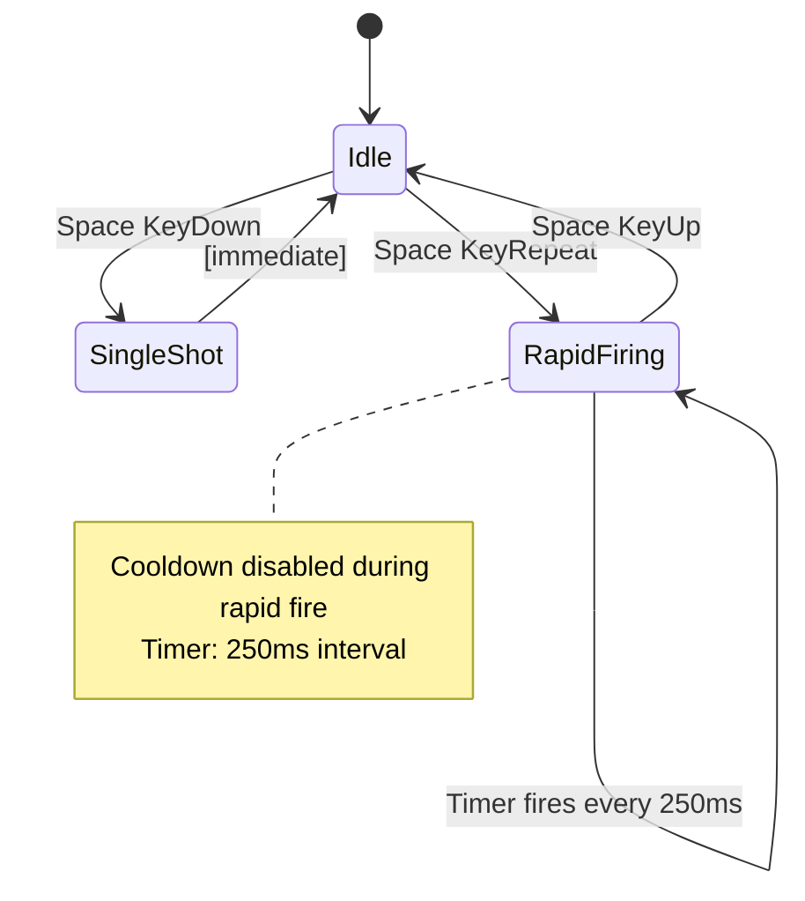
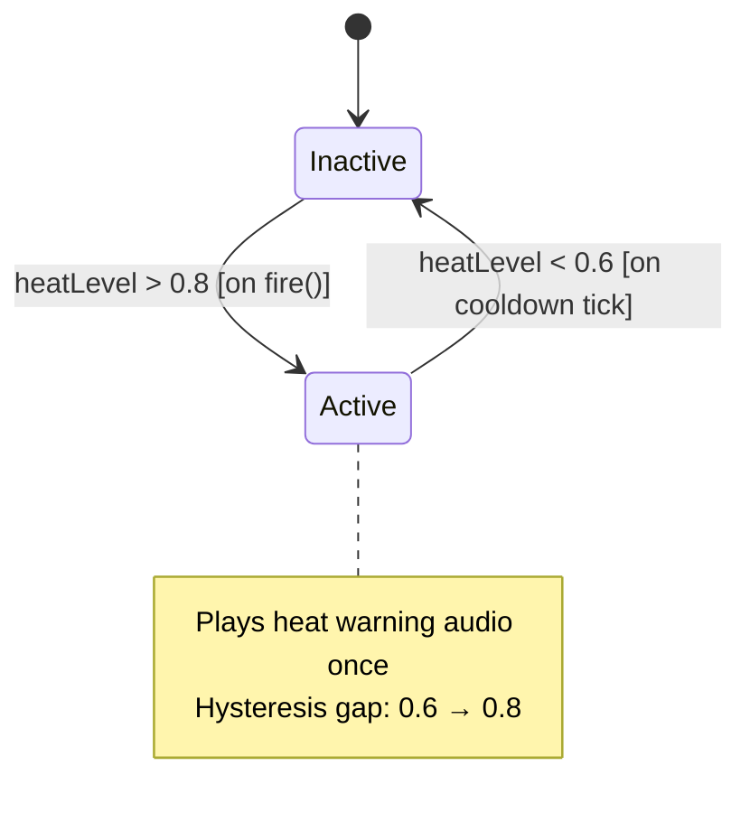
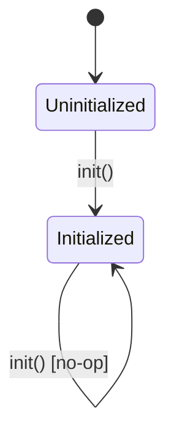
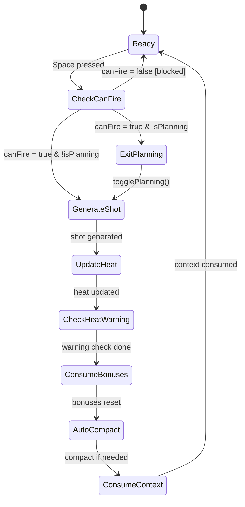
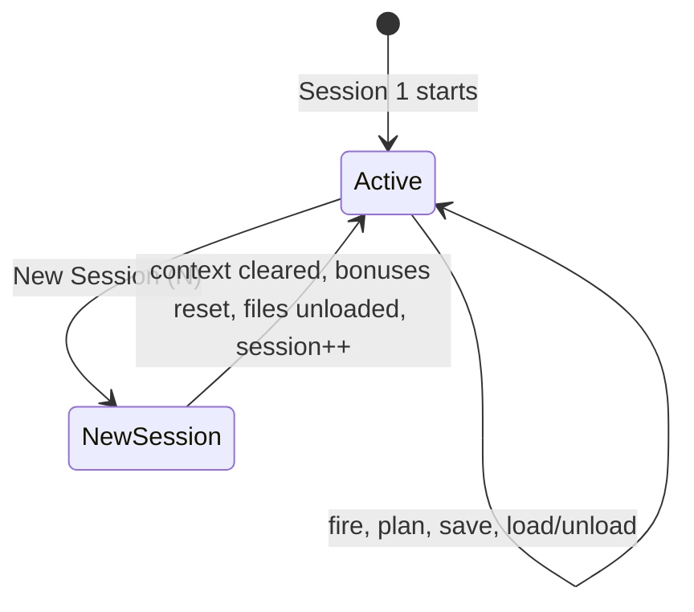
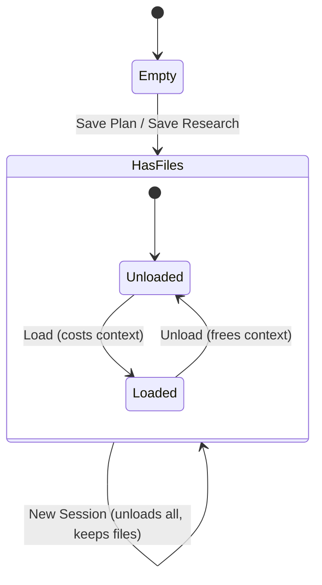

# Vibeslinger State Machines

## 1. Planning State Machine

The planning system controls how the player prepares before firing. Planning actions consume context window capacity in exchange for accuracy bonuses.

**Key guards:**
- Cannot apply aim/directScout while `isExecutingAction = true`
- Subagent scout bypasses the executing guard (can queue during execution)
- `canFire` returns `false` while executing, blocking shots during subagent wait
- Firing auto-exits planning mode and calls `consumeBonuses()`

**Source:** `lib/models/planning.dart`, `lib/models/game_state.dart:119-137`

---

## 2. Context Window State Machine

The context window tracks how much of the model's capacity is consumed. It has two orthogonal state dimensions: load zones and compaction status.

### Compaction State

### Load Zones

**Auto-compact trigger:** When `totalLoad > 0.8999`, `_autoCompactIfNeeded()` fires automatically on every `fire()` and `executePlanningAction()` call.

**Source:** `lib/models/context_window.dart`, `lib/models/game_state.dart:190-196`

---

## 3. Rapid Fire State Machine

Controlled by keyboard input on the space bar. Rapid fire bypasses passive cooldown.

**Source:** `lib/widgets/game_canvas.dart:84-96, 124-131`

---

## 4. Heat Warning State Machine

Hysteresis-based warning that triggers audio feedback when heat is dangerously high.

**The hysteresis gap** (0.6 to 0.8) prevents rapid toggling of the warning sound.

**Source:** `lib/widgets/game_canvas.dart:77-81, 52`

---

## 5. Audio Service Init

One-way initialization guard preventing double-loading of audio assets.

**Source:** `lib/services/audio_service.dart`

---

## 6. Firing Flow (Orchestration)

Not a standalone state machine, but the central orchestration that connects all others.

**Source:** `lib/widgets/game_canvas.dart:68-82`, `lib/models/game_state.dart:68-112`

---

## 7. Session State Machine

---

## 8. Workspace State Machine

